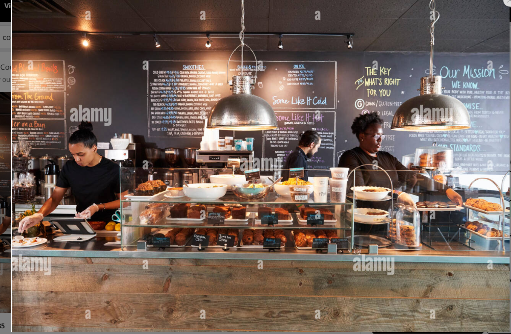

# COFFEE SALES DASHBOARD

## Introduction
This Coffee Sales Dashboard is designed to provide a detailed analysis of coffee sales over time, segmented by coffee type, size, and customer demographics.
It allows stakeholders to track sales performance across countries, identify top-selling products, and recognize valuable customers. The goal is to support data-driven decisions to optimize inventory, marketing strategies, and customer engagement.

## Dashboard Components
1.**_Time Period Filter:_**
  - The dashboard includes a date filter allowing users to select specific months and years, giving flexibility to analyze sales over chosen time frames (from January 2019 to mid-2022). This feature helps in understanding seasonal sales trends and year-over-year performance.
    
2.**_Product Filters:_**
  - Filters for Roast Type (Dark, Light, Medium) and Size (0.2 kg, 0.5 kg, 1.0 kg, 2.5 kg) enable users to segment sales data by specific coffee types and packaging options.
  - An additional filter for Loyalty Card (Yes/No) allows tracking of purchases by loyalty cardholders, providing insights into customer loyalty and retention.

## Key Insights
**_Total Sales Over Time_**
  - The line chart in the middle section of the dashboard visualizes Total Sales over Time for four different coffee types: Arabica, Excelsa, Liberica, and Robusta.
  - Each line represents monthly sales values for each coffee type, with fluctuations indicating varying popularity and seasonal trends. Notably,
 Arabica and Robusta tend to have higher sales spikes compared to Liberica and Excelsa, suggesting these are the more popular types among customers.

**_Sales by Country_**
- The Sales by Country bar chart provides a breakdown of revenue by region, revealing the United States as the leading market with total sales of $35,639, followed by Ireland with $6,697 and the United Kingdom with $2,799.
- This geographic analysis helps pinpoint high-value markets, indicating where promotional efforts could be intensified to drive growth.

**_Top 5 Customers_**
 - The Top 5 Customers section highlights the top buyers based on sales value, with Allis Wilmore leading at $317, followed by Brenn Dundredge ($307), Terri Farra ($289), Nealson Cutler ($282), and Don Flinliff ($278)
 - Identifying top customers allows for tailored loyalty programs or rewards, helping to retain high-value clients and encourage repeat purchases.

## Recommendations
**_Focus on High-Performing Regions:_** Given the strong sales in the United States, consider running targeted marketing campaigns or introducing loyalty programs to further capitalize on this market.

**_Enhance Customer Loyalty:_** Since loyalty cardholders can be tracked, introduce additional incentives or benefits to encourage non-cardholders to join, fostering long-term customer relationships.

**_Inventory Management:_** Given the sales variations by coffee type, stock Arabica and Robusta in higher quantities to meet demand, while monitoring stock levels for Excelsa and Liberica to avoid overstock.

**_Seasonal Promotions:_** Leverage seasonal sales trends identified in the line chart to run timely promotions. For instance, if sales peak during certain months, plan campaigns and stock replenishments accordingly.

**_Expand Market Reach:_** To grow the customer base in regions like Ireland and the United Kingdom, consider region-specific marketing or product offers tailored to local preferences.

## Conclusion
The Coffee Sales Dashboard provides valuable insights into product popularity, regional performance, and customer purchasing behavior. With this tool, coffee shop owners or sales teams can make informed decisions about inventory, marketing, and customer loyalty programs. This project demonstrates my ability to create data-driven visualizations that enable businesses to optimize their operations and enhance customer satisfaction.
